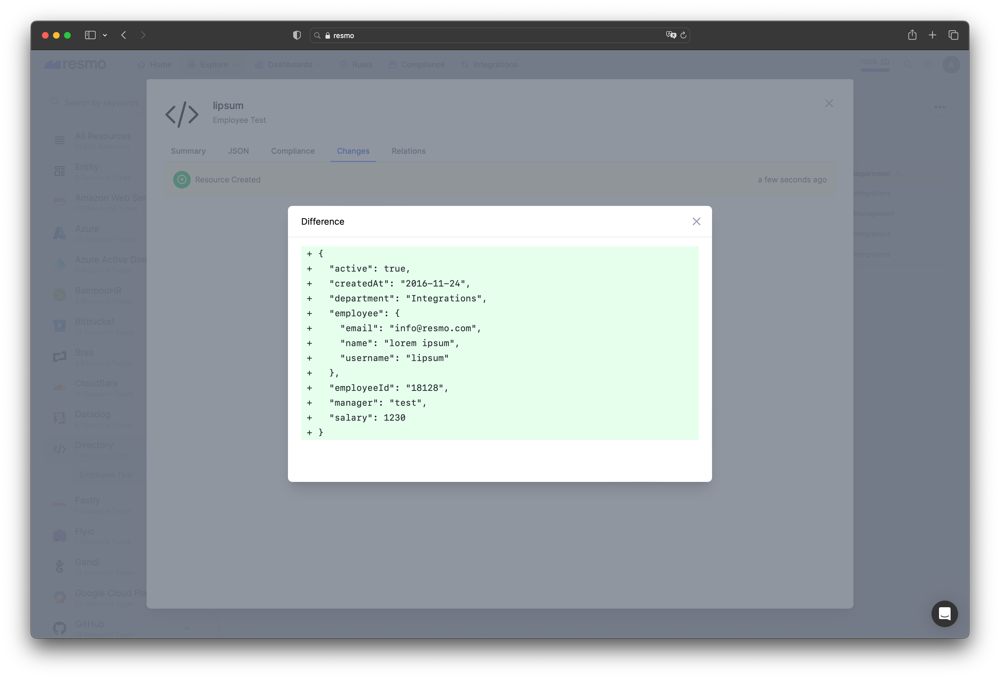
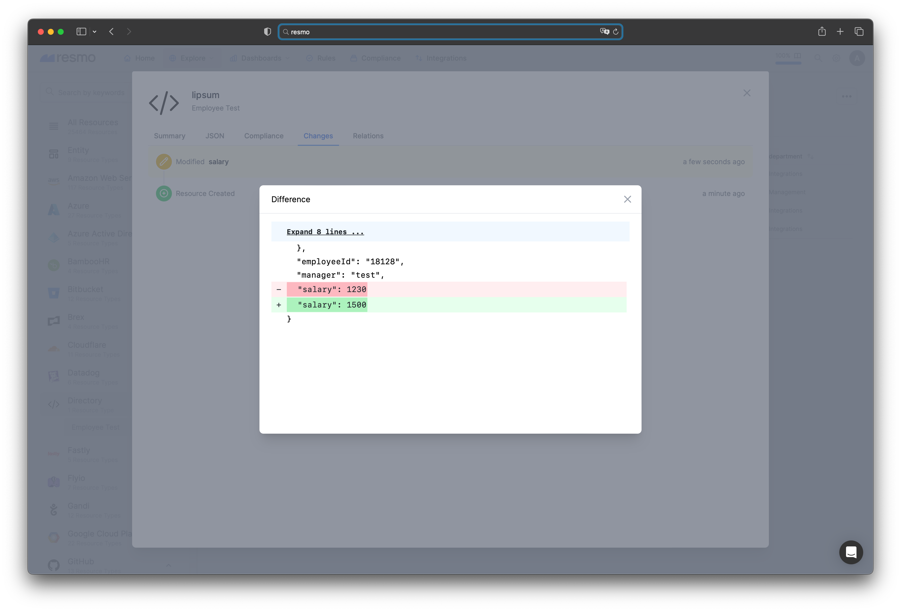
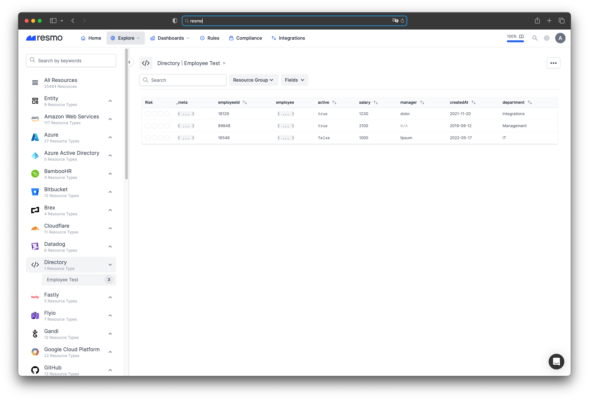
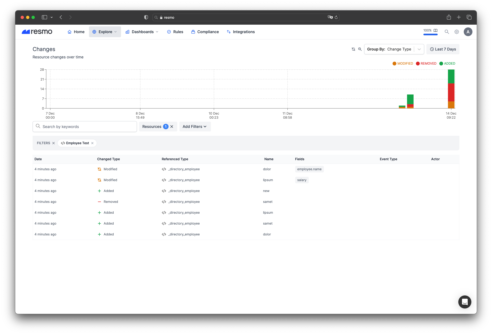

# Resmo Custom Data Resource/Schema Examples

## Example JSON schema for an employee
[Example JSON Schema](schema.json)

## Resource event (single)

### Add an example resource
[Valid example of payload](payload.json)
```bash
$ curl --request POST \
  --url https://YOUR_DOMAIN.resmo.app/integration/custom-data/event/YOUR_TABLE_NAME_HERE \
  --header 'Content-Type: application/json' \
  --header 'X-Ingest-Key: YOUR_INTEGRATION_INGEST_KEY_HERE' \
  --data 'PAYLOAD_HERE'
```
*Result of the payload:*


### Modify a field of the added resource

Use same example [payload](payload.json) again with changing salary field.

*Result of the payload:*


> If you set id field different from the previous, it will be evaluated as a new resource.

---

## Resource event (bulk)

### Add example resources
[Valid example of payload](bulk-payload.json)
```bash
$ curl --request POST \
  --url https://YOUR_DOMAIN.resmo.app/integration/custom-data/bulk-event/YOUR_TABLE_NAME_HERE \
  --header 'Content-Type: application/json' \
  --header 'X-Ingest-Key: YOUR_INTEGRATION_INGEST_KEY_HERE' \
  --data 'PAYLOAD_HERE'
```

*Result of the payload:*


Use same example [payload](payload.json) again with changing salary field.

*Result of the payload:*


> New id's will be evaluated as new resource, missing resources will be removed as nature of bulk events.

## Delete a resource
To remove resources with ids: ID1, ID2, ID3:
```bash
$ curl --request DELETE \
  --url https://YOUR_DOMAIN.resmo.app/integration/custom-data/YOUR_TABLE_NAME_HERE?resourceIds=ID1,ID2,ID3 \
  --header 'X-Ingest-Key: YOUR_INTEGRATION_INGEST_KEY_HERE'
```
*Remove employee with id '18129'*

